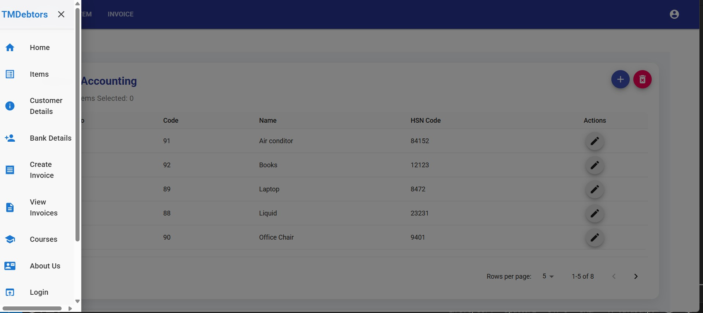
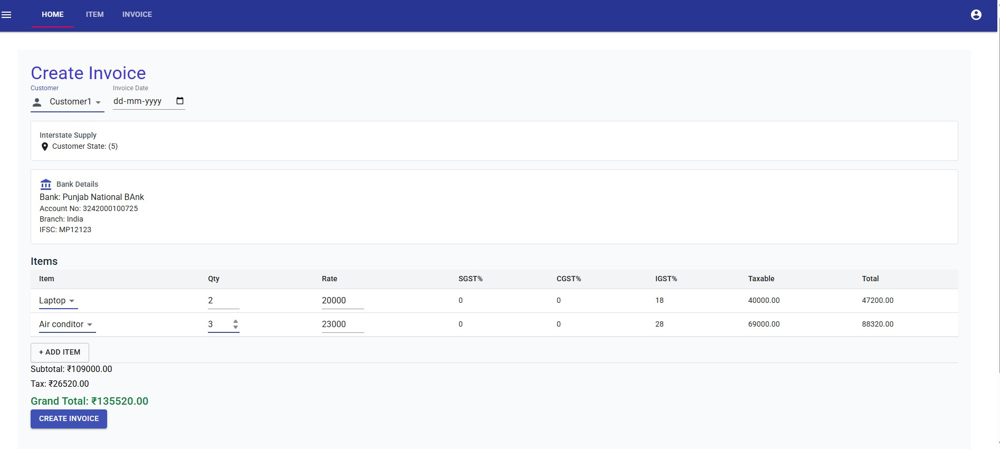
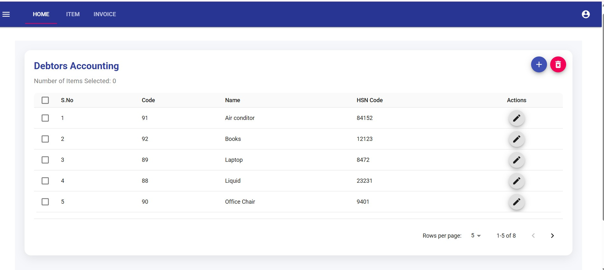
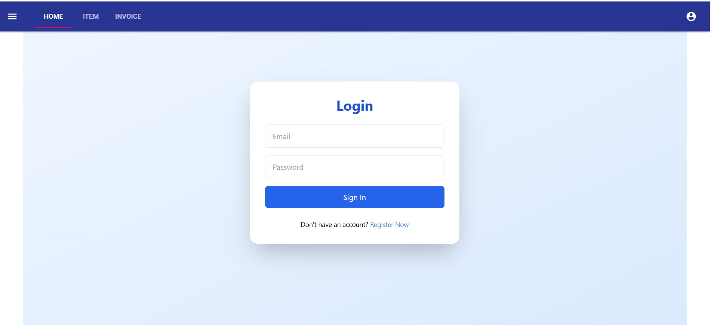
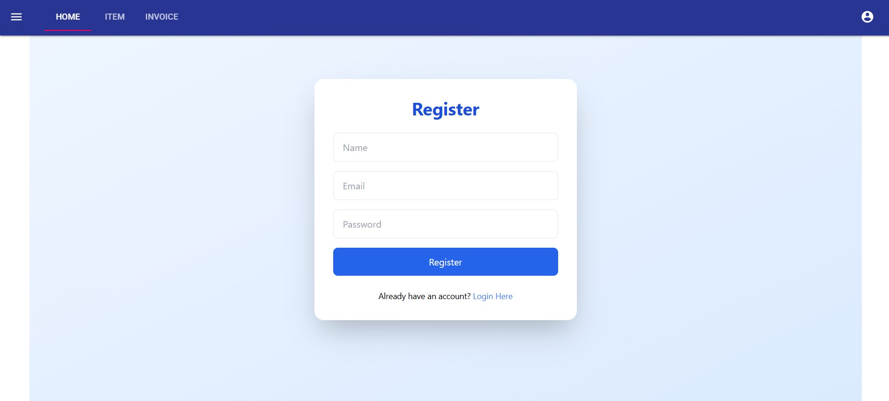

# TM Debtors Accounting System

A full-stack Debtors Accounting System built with React (frontend) and FastAPI (backend) with Oracle Database integration.

## Table of Contents

1. [Project Overview](#project-overview)
2. [Features](#features)
3. [Folder Structure](#folder-structure)
4. [Setup & Installation](#setup--installation)
5. [Running the Project](#running-the-project)
6. [Screenshots](#screenshots)
7. [Technologies Used](#technologies-used)

## Project Overview

TM Debtors Accounting System is designed to manage customers, traders, invoices, and items. It provides features like:

- Add, update, and remove customers and traders
- Create and manage invoices with multiple items
- Manage items and unit of measurement
- Role-based user authentication
- Dynamic dashboard for tracking financial data

## Features

- React-based responsive UI
- FastAPI backend with modular routers
- Oracle database integration
- JWT-based authentication (optional)
- CRUD operations for all entities
- Alert and notification system in frontend
- Accordion-style invoice display

## Folder Structure

Debtors-Accounting/
├── node_modules/
├── public/
├── src/
│   ├── components/      # React components
│   ├── controler/       # React controllers
│   ├── styles/          # CSS / Tailwind
│   ├── App.js
│   └── index.js
├── backend/
│   └── fastAPi/
│       ├── main.py
│       ├── models.py
│       ├── requirements.txt
│       ├── routers/     # API endpoints
│       └── datalayer/  # DB logic
└── ScreenShot/          # Screenshots & videos

## Screenshots

### Home Page

### Invoice Management

### Authentication Management

### Backend Setup (FastAPI)

cd backend/fastAPi

# Create virtual environment
python -m venv venv
# Activate environment
venv\Scripts\activate   # Windows

source venv/bin/activate # Linux/Mac
# Install dependencies

pip install -r requirements.txt

# Run FastAPI server
uvicorn fastAPi.main:app --reload

### Frontend Setup (React)
cd ../../

# Install dependencies
npm install
# Run React dev server
npm start

## Technologies Used

- **Frontend:** React, Material-UI
- **Backend:** FastAPI, Python.
- **Database:** Oracle DB
- **Version Control:** Git, GitHub
