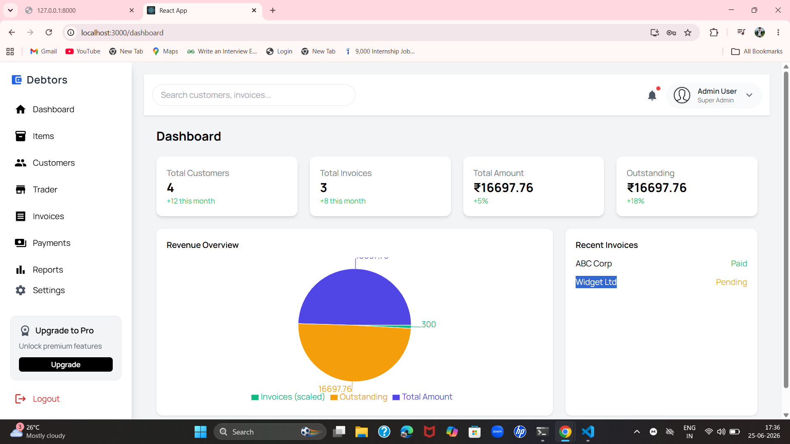
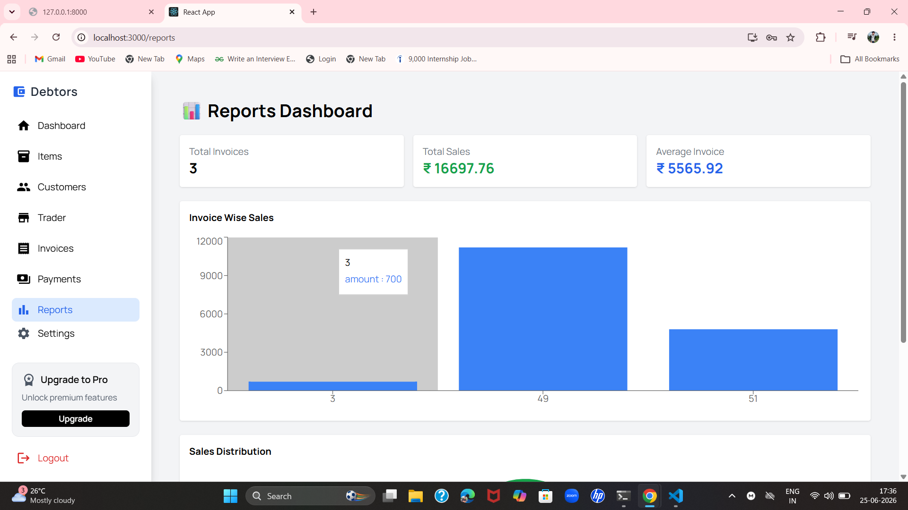
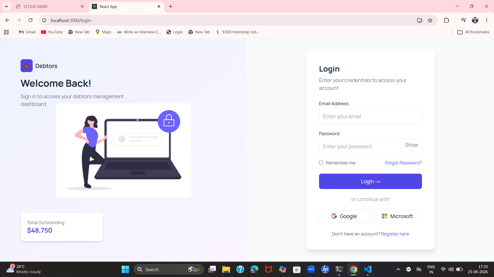

# TM Debtors Accounting System

A full-stack Debtors Accounting System built with React (frontend) and FastAPI (backend) with MySQl Database integration.

## Table of Contents

1. [Project Overview](#project-overview)
2. [Features](#features)
3. [Folder Structure](#folder-structure)
4. [Setup & Installation](#setup--installation)
5. [Running the Project](#running-the-project)
6. [Screenshots](#screenshots)
7. [Technologies Used](#technologies-used)

## Project Overview

TM Debtors Accounting System is designed to manage customers, traders, invoices, and items. It provides features like:

- Add, update, and remove customers and traders
- Create and manage invoices with multiple items
- Manage items and unit of measurement
- Role-based user authentication (Jwt)
- Dynamic dashboard for tracking financial data

## Features

- React-based responsive UI
- FastAPI backend with modular routers
- Oracle database integration
- JWT-based authentication (optional)
- CRUD operations for all entities
- Alert and notification system in frontend
- Accordion-style invoice display

## Folder Structure
## Folder Structure

Debtors-Accounting/
│
├─ README.md
├─ package.json
├─ src/
│  ├─ components/           # React components
│  ├─ Pages/            # React controllers
│  ├─                  # CSS / Tailwind styles
│  └─ App.js
├─ backend/
│  └─ fastAPi/
│     ├─ routers/           # FastAPI routers
│     │  ├─ authRouter.py
│     │  ├─ customerRouter.py
│     │  ├─ itemRouter.py
│     │  ├─ invoiceRouter.py
│     │  ├─ stateRouter.py
│     │  ├─ statusRouter.py
│     │  └─ uomRouter.py
│     └─ datalayer/         # Database layer
│        ├─ connector.py
│        ├─ config.py
│        ├─ dbconfig.xml
│        ├─ entities.py
│        ├─ exceptions.py
│        └─ managers.py
├─ ScreenShot/ 
 # Screenshots of app
 ## Screenshots

### Dashboard

  

### Login Page

    

### Login Page

  

### Register Page

  

### Backend Setup (FastAPI)

cd backend/fastAPi

# Create virtual environment
python -m venv venv

# Activate environment
venv\Scripts\activate   # Windows

pip install -r requirements.txt

# Run FastAPI server
uvicorn fastAPi.main:app --reload

### Frontend Setup (React)
cd ../../

# Install dependencies
npm install
# Run React dev server
npm start

## Technologies Used

- **Frontend:** React, Material-UI
- **Backend:** FastAPI, Python.
- **Database:** MySQl
- **Version Control:** Git, GitHub
